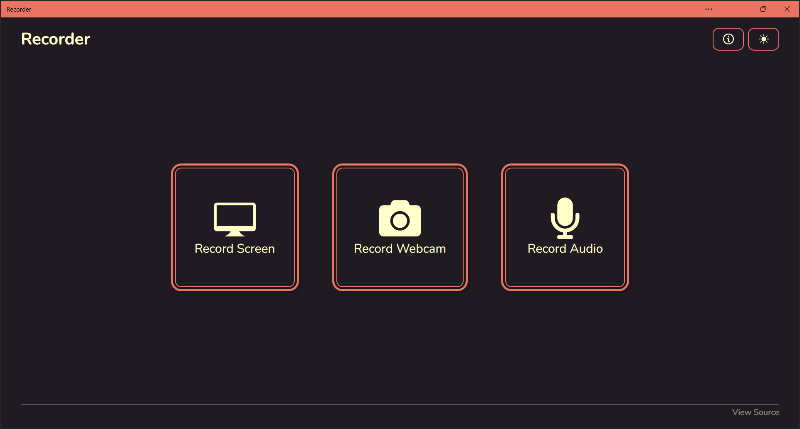

# Recorder
-----------------

A simple recorder powered by web-technologies!



## Features

- Powered by the web! Runs everywhere on a browser.
- No sign-up or downloads required.
- Installable as a Progressive-Web-App (PWA). Works offline!
- 100% Client-sided. No ads, no trackers, no server interaction at all.
- Record your screen, camera or microphone!

## Usage

1. Select one of the recording options. Your browser will prompt you to select what you want to share with this app.
2. Once selected, a preview of the stream will be shown. Click Record to start recording the screen.
3. You can Pause and Continue the recording process whenever you wish. When you're done, click the Stop button. This will stop the recording process and present you a preview of the recorded video.
4. Click on Download to save the recording to your device.

> Click on Reset or Discard to discard your recording at any stage.

> Click on the Preview to capture a Screenshot

## Development

The project is a Svelte Progressive-Web-App powered by Vite. Makes use of the Screen-Capture and Media-Recorder Web APIs.

### 1. Clone the repository

Clone the repository using git

```sh
git clone https://github.com/Shresht7/Recorder.git
```

or using the GitHub CLI

```sh
gh repo clone Shresht7/Recorder
```

### 2. Install dependencies

Install dependencies using npm

```sh
npm install
```

### 3. Run vite

Start the local development server using

```sh
npm run dev
```

and start developing!